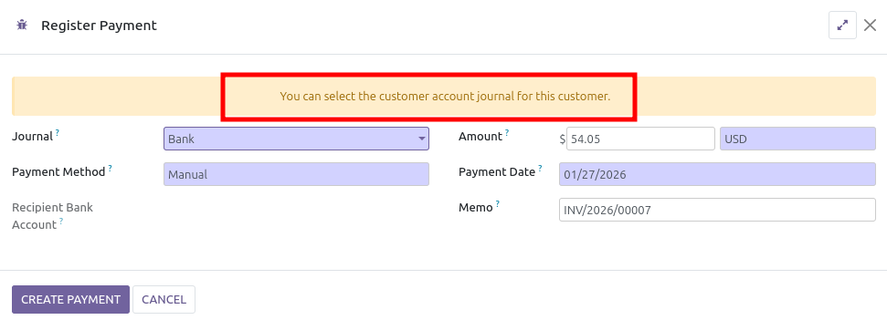

Credit Customer Wallet
~~~~~~~~~~~~~~~~~~~~~~

To credit a Customer Wallet:

1. Create a new customer invoice.
2. Select the Customer Wallet Product and put an amount.
3. Confirm the invoice.

   .. figure:: ../static/description/invoice_form_wallet_sale.png

As a result, the customer has now a credit amount in his customer wallet.

You can then check the Customer Wallet amount on the partner form:

1. Select the customer.
2. Open the **Sale & Purchase** tab.

   .. figure:: ../static/description/partner_form_wallet_amount.png

To see all the Customer Wallets, go to **Accounting > Customers > Customer
Wallets**.

   .. figure:: ../static/description/partner_tree_wallet_amount.png

Debit Customer Wallet
~~~~~~~~~~~~~~~~~~~~~

To debit a Customer Wallet, you can mark a customer invoice as paid using the
"Customer Wallet" account journal.

A message is present in the payment wizard.

