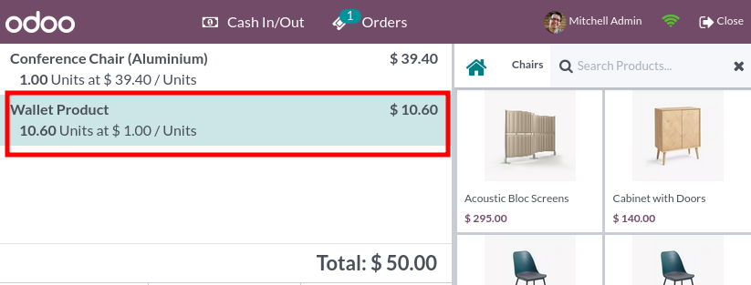
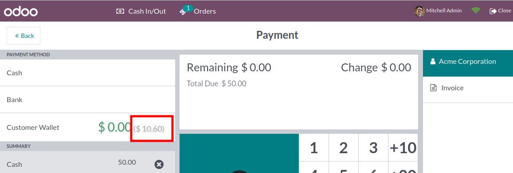
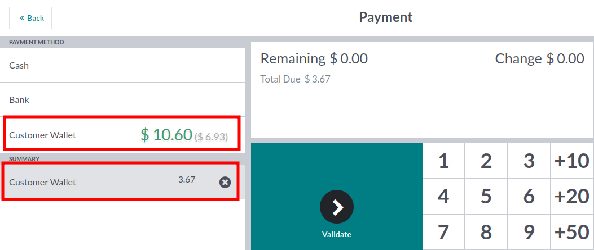
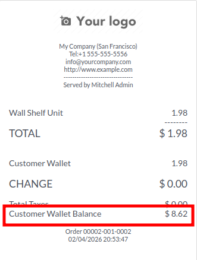

Credit Customer Wallet
~~~~~~~~~~~~~~~~~~~~~~

To credit a Customer Wallet:

1. Create a new order and select a customer.
2. (Optionally) Add products.
3. Add the customer wallet product and adjust quantity or price.

On the payment screen, you can see the balance the customer wallet will have once the payment is made.

Debit Customer Wallet
~~~~~~~~~~~~~~~~~~~~~

To debit a Customer Wallet:

1. Create a new order, select a customer and products.
2. On the payment screen, select the wallet payment method to mark the order as
   paid.

Balance Display on Receipt
~~~~~~~~~~~~~~~~~~~~~~~~~~

Display Customer Wallets
~~~~~~~~~~~~~~~~~~~~~~~~

A new column is available on the customer list screen, displaying the wallet
balance for each customer.

.. figure:: ../static/description/pos_customer_wallet_list.png
